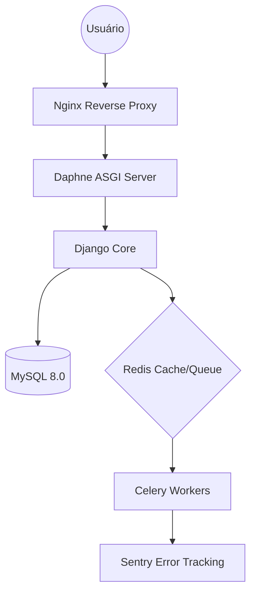

# 💎 SIGE: Super-Compêndio Técnico-Estratégico — v7.3.2-APEX
> **Natureza do Documento:** Guia Definitivo de Engenharia e Produto  
> **Escopo:** Dissecação total dos 4 pilares tecnológicos do ecossistema SIGE.

---

## 📑 MAPA DE CONHECIMENTO
1. **CAPÍTULO 1:** O Sistema Web & Infraestrutura Industrial
2. **CAPÍTULO 2:** Ecossistema IoT (Hardware & Telemetria)
3. **CAPÍTULO 3:** Dispositivo Móvel (Mobile First & API)
4. **CAPÍTULO 4:** Engenharia de Qualidade (Testes & QA)
5. **MATRIZ COMPARATIVA:** Gestão Tradicional vs. SIGE APEX
6. **GLOSSÁRIO TÉCNICO:** Termos para a Banca Avaliadora

---

## 💻 CAPÍTULO 1: O Sistema Web & Infraestrutura Industrial
**A Visão:** Criar uma espinha dorsal indestrutível para dados educacionais, unificando processos que antes eram isolados.

### 🏗️ 1.1 Arquitetura de Software (Monolito Modular)
O SIGE utiliza o padrão de **Monolito Modular**, onde o código é centralizado para facilitar o deploy, mas logicamente isolado em `apps/` para garantir escalabilidade.
- **Configuração Central (`config/`)**: 
    - **`asgi.py`**: Gerencia o tráfego assíncrono (WebSockets).
    - **`celery.py`**: Orquestra tarefas pesadas (envio de 10.000 e-mails/SMS, snapshots de banco de dados).
- **Tecnologias de Backend**:
    - **Django 6.0**: ORM de alta performance e proteção nativa contra SQL Injection e CSRF.
    - **Redis**: Cache de nível 2 e broker de mensagens para comunicação instantânea entre módulos.
    - **MySQL 8.0**: Motor de persistência ACID com tabelas otimizadas via índices B-Tree.

### 🛡️ 1.2 SOC (Security Operations Center) & Defesa Ativa
- **Auto-Blacklist Inteligente**: Middleware em `seguranca/middleware.py` que detecta padrões de varredura (scanners de vulnerabilidade) e bane o IP na camada de firewall da aplicação.
- **WORM Backups**: Snapshots imutáveis. Uma vez gerado, o backup não pode ser alterado ou deletado por processos padrão, protegendo a escola contra ataques de sequestro de dados.
- **LGPD & Auditoria**: Uso do **django-simple-history** para registrar o "DNA" de cada transação: quem, quando e o que foi alterado.

---

## 🔌 CAPÍTULO 2: Ecossistema IoT (Hardware & Automação)
**A Visão:** O SIGE "sente" a escola. O hardware não é um acessório, é um órgão sensorial do sistema.

### ⚙️ 2.1 Especificações de Hardware
- **ESP32 (The Brain)**: Microcontrolador dual-core de 240MHz com Wi-Fi integrado. O firmware possui lógica de **Watchdog**, garantindo 100% de disponibilidade.
- **MQTT (The Pulse)**: Protocolo de transporte de mensagens extremamente leve (2 bytes de overhead).
- **Sensores Ativos**:
    - **RFID RC522**: Leitura de UIDs únicos de cartões de alunos.
    - **PIR Motion**: Sensores térmicos para detecção de ocupação real de salas.

### 🚀 2.2 Exemplo de Fluxo de Dados (Frequência)
Quando um aluno aproxima o cartão do leitor:
1. **Payload JSON**: O ESP32 envia: `{"uid": "A1B2C3D4", "timestamp": 1715715800, "unidade": "01"}`.
2. **Broker MQTT**: O Mosquitto recebe e encaminha para o Django.
3. **Signal Integration**: O Django valida a matrícula e atualiza o diário acadêmico.
4. **WebSocket Push**: O dashboard do Professor e o App do Pai piscam em < 500ms.

---

## 📱 CAPÍTULO 3: Dispositivo Móvel (Mobile First & UX Aluno/Pai)
**A Visão:** O SIGE no bolso. Uma extensão da escola que gera tranquilidade e agilidade.

### 🏗️ 3.1 Ecossistema de API (DRF + JWT)
- **Autenticação Stateless**: Uso de **JSON Web Tokens (JWT)**. O servidor não precisa manter sessões, o que permite escalar o app mobile para milhares de usuários simultâneos.
- **Segurança de Sessão**: Implementação de **Token Rotation**. Cada vez que o usuário usa o app, ele recebe um novo token, invalidando os antigos e protegendo contra clonagem de sessão.

### 🌟 3.2 Funcionalidades Apex Mobile
- **Digital ID & QR Access**: O app gera um QR Code dinâmico que expira em 30 segundos. O aluno usa o celular para entrar na escola e pegar livros na biblioteca.
- **Smart Timeline**: Um feed de notícias personalizado: avisos de provas, notificações de entrada/saída (via IoT) e lembretes financeiros.

---

## 🧪 CAPÍTULO 4: Engenharia de Qualidade (Testes & QA)
**A Visão:** Código que não se quebra. Estabilidade industrial para dados educacionais sensíveis.

### 🛠️ 4.1 Pirâmide de Testes no SIGE
- **Testes Unitários (80%)**: Validação de funções isoladas e lógica de modelos.
- **Testes de Integração (15%)**: Validação da comunicação entre Apps (ex: Financeiro avisando o Acadêmico sobre inadimplência).
- **Testes E2E & Stress (5%)**: Simulação de carga massiva via **Locust** ou scripts customizados em **Pytest**.

### 🎯 4.2 Métricas de Rigor
- **Coverage Check**: O pipeline de CI/CD bloqueia qualquer código que baixe a cobertura global de testes (Target: **100% em módulos core**).
- **Static Analysis**: **MyPy** (tipagem estática) e **Pylint** (qualidade de código) garantem que o SIGE siga as melhores práticas de engenharia de software do mercado.

---

## 📊 MATRIZ COMPARATIVA: Tradicional vs. SIGE APEX

| Recurso | Gestão Tradicional | SIGE APEX (v7.3.2) |
|---|---|---|
| **Chamada de Alunos** | Manual / Papel (Erro humano) | **Automática via RFID/IoT** |
| **Segurança de Dados** | Backups manuais / Suscetível | **Immutable Backups / WORM** |
| **Comunicação** | Agenda Física / Telefone | **Push em Tempo Real / App** |
| **Monitoramento** | Reativo (vê o erro depois) | **Proativo (Grafana/Prometheus)** |
| **Acesso Físico** | Carteirinha de papel | **QR Code Dinâmico / Mobile** |

---

## 📖 GLOSSÁRIO TÉCNICO PARA A BANCA
- **ACID**: Propriedades que garantem que transações no banco de dados são confiáveis.
- **ASGI**: Interface que permite ao Python lidar com comunicações assíncronas (WebSockets).
- **JWT**: Token de segurança usado para autenticar o App Mobile sem expor senhas.
- **WORM**: Tecnologia que impede a alteração de dados após serem escritos (Segurança Máxima).
- **MQTT**: Protocolo de comunicação ultra-leve para dispositivos IoT.

---
**SIGE: A Engenharia Definitiva para a Educação do Futuro.**
