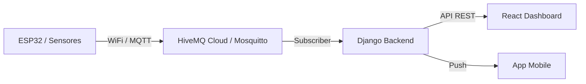

# 🤖 SIGE — IoT & Automação (P&D)
### Integração entre Hardware e Gestão Acadêmica

> Este módulo gerencia a camada de hardware do SIGE, utilizando **ESP32** e o protocolo **MQTT** para automatizar processos físicos na escola.

 

 

[Propostas](#-propostas-de-automa%C3%A7%C3%A3o) · [Arquitetura](#-arquitetura-t%C3%A9cnica) · [Simulação](#-simula%C3%A7%C3%A3o--testes)

---

## 🏛️ 1. O Papel do IoT no Ecossistema

O módulo IoT é o braço físico do SIGE, responsável por:
1.  **Coleta de Dados em Tempo Real**: Presença via RFID e sensores de ocupação.
2.  **Sinalização Física**: Displays de aviso e horários nos corredores.
3.  **Segurança e Acesso**: Controle de catracas e portas via QR Code/RFID.

---

## 🚀 2. Propostas de Automação

### 🎟️ Frequência Automática (RFID)
*   **Hardware**: ESP32 + Módulo RC522.
*   **Fluxo**: O aluno aproxima a tag RFID na entrada da sala -> ESP32 publica no MQTT -> Django registra presença no módulo `academico`.

### 📢 Painéis de Comunicados Digital
*   **Hardware**: ESP32 + Display TFT/Matriz de LED.
*   **Fluxo**: O display consome a API REST do SIGE para exibir o próximo horário da sala ou avisos da coordenação.

### 🔐 Controle de Acesso
*   **Hardware**: ESP32-CAM ou Leitor de QR Code.
*   **Fluxo**: Validação da carteirinha digital do app mobile para liberar entrada.

---

## 🏗️ 3. Arquitetura Técnica

---

## 🧪 4. Simulação & Testes

Um dos diferenciais do SIGE é a capacidade de testar a camada IoT sem o hardware físico:
-   **Pytest + Mocks**: Simulamos as mensagens MQTT para garantir que a lógica de presença funcione perfeitamente.
-   **CI/CD Integration**: Os testes de hardware simulado rodam automaticamente em cada push no GitHub.

---

Transformando a infraestrutura escolar em inteligência viva.

