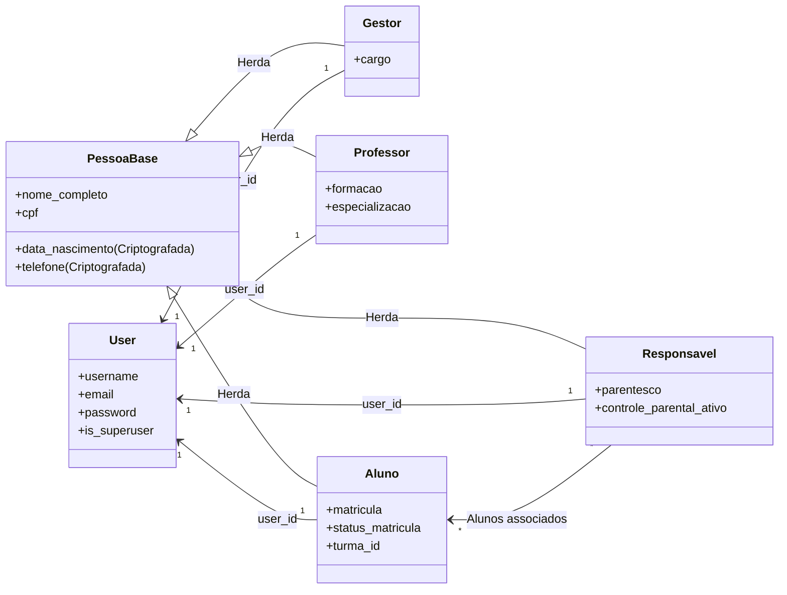

# 🏛️ Documentação de Perfis de Usuário — SIGE

Esta documentação descreve a arquitetura de **Controle de Acessos e Perfis de Usuário** do ecossistema **SIGE**. 

O sistema utiliza uma abordagem híbrida de autenticação baseada em perfis vinculados (`OneToOneField`) com o modelo padrão `django.contrib.auth.models.User`. Os perfis de pessoa física herdam atributos comuns de uma classe abstrata denominada `PessoaBase` e operam sob regras de negócio específicas para cada papel acadêmico/administrativo.

---

## 📐 Estrutura Base (`PessoaBase`)

Os perfis de **Docente**, **Discente**, **Gestor** e **Responsável** herdam diretamente da classe abstrata `PessoaBase` (definida em [modelo_base.py](file:///c:/Users/gu268/Projetos/Django-projetos/SIGE/apps/comum/models/modelo_base.py#L52)), a qual implementa:

1. **Multitenancy:** Herda de `TenantModel` para isolamento de dados de cada instituição escolar.
2. **Campos Pessoais Criptografados (AES-256):** Proteção em conformidade com a LGPD para dados sensíveis:
   * `data_nascimento` (`EncryptedDateField`)
   * `telefone` (`EncryptedCharField`)
   * `logradouro`, `numero`, `complemento` (`EncryptedCharField`)
3. **Outros Campos:** `nome_completo`, `cpf` (validado), `cep`, `estado` (UF), `cidade`, `bairro`, `foto`, `criado_em` e `atualizado_em`.

---

## 👤 Detalhamento dos Perfis

### 1. 🛡️ Superusuário (Administrador do Sistema)
O Superusuário representa o nível mais alto de privilégio no sistema. É gerenciado diretamente pelo modelo nativo `auth.User` do Django (com a flag `is_superuser=True`).

* **Modelos Relacionados:** Não requer um modelo de perfil OneToOne específico (a menos que precise atuar como docente/aluno).
* **Escopo de Acesso:**
  * Acesso irrestrito ao painel de administração do Django (`/admin/`).
  * Gerenciamento global de inquilinos (Tenants/Escolas).
  * Criação, edição e exclusão de qualquer registro do banco de dados.
  * Configuração de variáveis críticas do sistema.

---

### 2. 👨‍🏫 Docente (Professor)
Representa o corpo docente responsável pelas atividades acadêmicas. Vinculado a disciplinas específicas em uma ou mais turmas.

* **Model Python:** [Professor](file:///c:/Users/gu268/Projetos/Django-projetos/SIGE/apps/usuarios/models/perfis.py#L48) (tabela `core_professor`).
* **Campos Específicos:**
  * `formacao` (`CharField`): Formação acadêmica do professor.
  * `especializacao` (`CharField`): Área de especialização.
  * `area_atuacao` (`CharField`): Áreas e disciplinas que leciona.
* **Regras de Negócio e Permissões:**
  * Lançamento de notas (`Nota`) e controle diário de presenças/faltas (`Frequencia`).
  * Publicação de materiais didáticos e referências (`MaterialDidatico`).
  * Criação e acompanhamento de planos de aula (`PlanejamentoAula`).

---

### 3. 🎓 Discente (Aluno)
Representa o estudante matriculado em uma turma específica. Suas credenciais de acesso são sincronizadas diretamente com a sua matrícula escolar.

* **Model Python:** [Aluno](file:///c:/Users/gu268/Projetos/Django-projetos/SIGE/apps/usuarios/models/perfis.py#L79) (tabela `core_aluno`).
* **Campos Específicos:**
  * `matricula` (`CharField`, unique): Matrícula identificadora gerada pelo sistema.
  * `turma` (`ForeignKey` para `Turma`): Vínculo com a turma e grade do ano letivo.
  * `status_matricula` (`CharField`): `ATIVO`, `INATIVO`, `EVADIDO`, `TRANSFERIDO`, `FORMADO`.
  * `naturalidade`, `responsavel1`, `responsavel2`, `possui_necessidade_especial`, `descricao_necessidade`.
* **Regras de Negócio Importantes:**
  * **Geração de Matrícula:** Ao criar o aluno, o sistema gera uma matrícula única no padrão `YYYYTTTUUUU` (Ano + ID Turma + ID Usuário).
  * **Sincronização de Login:** O método `save()` do aluno força a atualização do `username` do `User` vinculado para que seja exatamente igual à matrícula gerada.
  * **Escopo de Acesso:** Acesso via aplicativo mobile ou web para consulta de notas, frequência, materiais didáticos, cronograma de aulas e carteirinha estudantil.

---

### 4. 💼 Gestor (Administrador Escolar)
Responsável pelo gerenciamento operacional, financeiro e administrativo da unidade escolar.

* **Model Python:** [Gestor](file:///c:/Users/gu268/Projetos/Django-projetos/SIGE/apps/usuarios/models/perfis.py#L23) (tabela `core_gestor`).
* **Campos Específicos:**
  * `cargo` (`CharField`): Define a função do gestor, com opções de `diretor` (Diretor), `vice_diretor` (Vice-Diretor), `secretario` (Secretário) ou `coordenador` (Coordenador).
* **Regras de Negócio e Permissões:**
  * Cadastro e alocação de turmas, alunos e professores.
  * Acesso a painéis financeiros (faturamento, inadimplência e lançamentos).
  * Publicação de comunicados institucionais (`Comunicado`).
  * Visualização de auditoria e registros de segurança de acessos.

---

### 5. 👥 Responsável (Controle Parental)
*Perfil complementar de grande relevância no ecossistema mobile.* Representa os pais ou responsáveis legais pelos alunos cadastrados.

* **Model Python:** [Responsavel](file:///c:/Users/gu268/Projetos/Django-projetos/SIGE/apps/usuarios/models/perfis.py#L163) (tabela `core_responsavel`).
* **Campos Específicos:**
  * `parentesco` (`CharField`): Grau de parentesco (Pai, Mãe, Tutor, etc).
  * `alunos` (`ManyToManyField` para `Aluno`): Lista de alunos associados ao responsável.
  * `controle_parental_ativo` (`BooleanField`): Ativa ou desativa notificações e monitoramento parental em tempo real.
  * `limite_diario_minutos` (`PositiveIntegerField`): Tempo máximo permitido de uso do sistema pelo aluno por dia.
* **Regras de Negócio:**
  * Permite ao responsável monitorar as notas, faltas e notificações dos alunos associados em tempo real através do aplicativo móvel.

---

## 🗺️ Mapeamento de Relacionamentos (Diagrama ER Simplificado)

